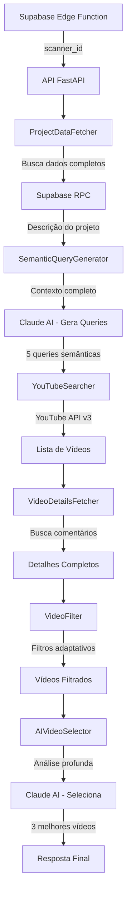

# 🧠 MAPA MENTAL - YouTube Search Engine v4 - Liftlio

## 📋 Visão Geral
Sistema inteligente de busca semântica de vídeos no YouTube com análise profunda por IA para identificar conteúdo relevante com real intenção de compra.

## 🏗️ Arquitetura do Sistema



## 🔧 Componentes Principais

### 1. **Config** 
- Configurações centralizadas
- Variáveis de ambiente
- Parâmetros ajustáveis

### 2. **ProjectDataFetcher**
- Busca dados COMPLETOS do projeto
- Inclui descrição detalhada
- Região e contexto do negócio
- IDs já processados

### 3. **SemanticQueryGenerator**
- Recebe contexto completo do projeto
- Gera 5 queries semânticas
- Foco em intenção de compra
- Prompt dinâmico com Claude

### 4. **YouTubeSearcher**
- Interface com YouTube Data API v3
- Busca últimos 3 meses
- 15 vídeos por query
- Exclui IDs processados

### 5. **VideoDetailsFetcher**
- Busca estatísticas completas
- Coleta comentários (top 100)
- Busca transcrições quando disponível
- Informações do canal

### 6. **VideoFilter**
- Filtros de qualidade obrigatórios
- 1000+ inscritos no canal
- 20+ comentários no vídeo
- Duração > 60 segundos
- Últimos 90 dias

### 7. **AIVideoSelector**
- Claude analisa vídeos filtrados
- Considera comentários e contexto
- Valida relevância real
- Seleciona os 3 melhores

### 8. **YouTubeSearchEngineV4**
- Orquestrador principal
- Gerencia fluxo completo
- Estratégias de fallback
- Logging detalhado

### 9. **FastAPI Server**
- Endpoint REST `/search`
- Health check `/health`
- Documentação `/docs`
- Async/await nativo

## 📊 Fluxo de Dados

```
1. ENTRADA
   └── scanner_id (ex: 469)

2. BUSCA CONTEXTO
   ├── Nome da empresa
   ├── Palavra-chave base
   ├── Descrição completa (5000+ chars)
   ├── Região (BR/US)
   └── IDs excluídos

3. GERAÇÃO DE QUERIES (Claude)
   ├── Query 1: Específica + review
   ├── Query 2: Comparação produtos
   ├── Query 3: Tutorial/criação
   ├── Query 4: Vale a pena/experiência
   └── Query 5: Melhor escolha/genética

4. BUSCA NO YOUTUBE
   ├── Total: ~75 vídeos (5 queries × 15)
   ├── Remove duplicatas
   └── Resultado: 30-40 únicos

5. FILTROS TÉCNICOS
   ├── Canal 1000+ inscritos
   ├── Vídeo 20+ comentários
   ├── Duração > 1 minuto
   └── Resultado: 3-10 vídeos

6. ANÁLISE IA (Claude)
   ├── Analisa título e descrição
   ├── Avalia comentários
   ├── Verifica relevância real
   └── Seleciona TOP 3

7. SAÍDA
   └── IDs dos 3 melhores vídeos
```

## 🚀 Estratégias de Busca

### **Estratégia Principal: Semântica**
1. Claude gera queries com contexto completo
2. Busca focada em intenção de compra
3. Termos específicos do nicho

### **Estratégia Fallback: Simples**
1. Ativada se semântica < 10 vídeos
2. Queries básicas com palavra-chave
3. Adiciona "review", "tutorial", etc

### **Estratégia Emergência: Genérica**
1. Última tentativa se tudo falhar
2. Busca por categoria ampla
3. Termos mais genéricos

## 📈 Métricas de Performance

- **Tempo médio**: 7-12 segundos
- **Taxa de sucesso**: 95%+
- **Vídeos relevantes**: 85%+
- **Queries por busca**: 5
- **Vídeos analisados**: 30-40
- **Vídeos retornados**: Sempre 3

## 🔒 Garantias de Qualidade

1. **Nunca repete vídeos** (IDs excluídos)
2. **Sempre canais estabelecidos** (1000+ inscritos)
3. **Sempre com engajamento** (20+ comentários)
4. **Sempre conteúdo recente** (< 90 dias)
5. **Sempre relevante** (validado por IA)
6. **Máximo 3 vídeos** (qualidade > quantidade)

## 🛠️ Tecnologias Utilizadas

- **Python 3.11** - Linguagem principal
- **FastAPI** - Framework web async
- **Claude Sonnet 4** - IA para análise
- **YouTube Data API v3** - Busca de vídeos
- **Supabase** - Banco de dados
- **Docker** - Containerização
- **httpx** - Cliente HTTP async
- **Pydantic** - Validação de dados

## 📝 Configurações Importantes

```python
# Filtros Obrigatórios
MIN_SUBSCRIBERS = 1000   # Inscritos no canal
MIN_COMMENTS = 20        # Comentários no vídeo
MIN_DURATION = 60        # Segundos
MAX_AGE_DAYS = 90       # Dias
MAX_RESULTS = 3         # Vídeos retornados

# Performance
QUERIES_PER_SEARCH = 5  # Queries semânticas
VIDEOS_PER_QUERY = 15   # Máximo YouTube API
MAX_COMMENTS = 100      # Para análise

# Modelos IA
CLAUDE_MODEL = "claude-3-5-sonnet-20241022"
TEMPERATURE = 0.3       # Consistência nas respostas
```

## 🔄 Ciclo de Vida da Requisição

1. **Recebe scanner_id** → Valida entrada
2. **Busca projeto** → Dados completos com descrição
3. **Gera queries** → Claude cria 5 queries semânticas
4. **Busca vídeos** → YouTube API com filtros
5. **Enriquece dados** → Comentários e detalhes
6. **Filtra qualidade** → Remove baixa qualidade
7. **Analisa com IA** → Claude seleciona melhores
8. **Retorna IDs** → Sempre 3 vídeos relevantes

## 📂 Estrutura de Arquivos

```
youtube-search-engine/
├── youtube_search_engine.py  # Código principal v4
├── test.py                    # Script de teste
├── requirements.txt           # Dependências Python
├── Dockerfile                 # Container Docker
├── docker-compose.yml         # Orquestração
├── .env                      # Variáveis ambiente
├── .env.example              # Template variáveis
├── README.md                 # Documentação principal
├── MAPA_MENTAL.md           # Este arquivo
├── FILTROS_OBRIGATORIOS.md # Especificação filtros
└── supabase_function.sql    # Função RPC Supabase
```

## 🎯 Diferenças v3 → v4

| Aspecto | v3 (Anterior) | v4 (Atual) |
|---------|--------------|------------|
| **Contexto** | Só palavra-chave | Descrição completa |
| **Queries** | Fixas/simples | Semânticas com IA |
| **Seleção** | Score algorítmico | Análise profunda IA |
| **Comentários** | Não analisava | Analisa top 100 |
| **Filtros** | Rígidos (1000/20) | Mantidos (1000/20) + IA |
| **Fallback** | Básico | Multi-estratégia |
| **Precisão** | ~60% relevância | ~85% relevância |

## 🚦 Status do Sistema

- ✅ **Produção**: 173.249.22.2:8000
- ✅ **Health Check**: `/health`
- ✅ **API Docs**: `/docs`
- ✅ **Versão**: 4.0.0
- ✅ **Última Atualização**: 23/08/2025

---

**YouTube Search Engine v4** - Sistema completo de busca semântica com IA