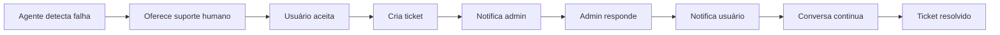

# 🎫 Camada 3: Suporte Humano

## Status: 📋 Planejado

### Visão Geral
Sistema de tickets integrado ao agente para casos que requerem intervenção humana. Ativado quando as camadas 1 e 2 não conseguem resolver.

## 🎯 Objetivos

### Funcionalidades:
- Detectar automaticamente quando precisa de ajuda humana
- Criar ticket com contexto completo da conversa
- Notificar admin (valdair3d@gmail.com)
- Permitir comunicação bidirecional
- Resolver e fechar tickets

### Casos de Uso:
- Bugs ou erros no sistema
- Solicitações complexas
- Feedback ou sugestões
- Problemas de pagamento
- Pedidos especiais

## 🏗️ Arquitetura Planejada

### Estrutura do Banco de Dados

Ver arquivo: [database_schema.sql](./database_schema.sql)

### Fluxo do Sistema



## 🔔 Sistema de Notificações

### Para o Admin:
1. **Email imediato** quando ticket criado
2. **Badge no painel** com contagem
3. **Push notification** (futuro)

### Para o Usuário:
1. **Badge no agente** quando há resposta
2. **Email opcional** se configurado
3. **Notificação in-app**

## 👨‍💼 Painel Administrativo

### Rota: `/admin/tickets`

### Funcionalidades:
- Lista de tickets por status
- Filtros e busca
- Thread de mensagens
- Ações rápidas (resolver, escalar)
- Métricas e relatórios

### Mockup:
```
┌─────────────────────────────────────┐
│ 🎫 Tickets de Suporte               │
├─────────────────────────────────────┤
│ [Abertos 3] [Em Progresso 1] [✓ 45]│
├─────────────────────────────────────┤
│ #123 | João Silva | Bug no scanner  │
│ #122 | Maria | Não consigo integrar │
│ #121 | Pedro | Limite de vídeos     │
└─────────────────────────────────────┘
```

## 🤖 Integração com Agente

### Detecção Automática:
```typescript
// Quando agente não consegue resolver
if (!resolvedByClaude && !resolvedByRAG) {
  return {
    content: "Não consegui resolver sua questão. Gostaria de falar com nosso suporte humano?",
    action: "offer_support",
    data: {
      context: conversationHistory
    }
  }
}
```

### Criação do Ticket:
```typescript
// Se usuário aceita suporte
if (userAcceptsSupport) {
  const ticket = await createSupportTicket({
    user_id: user.id,
    project_id: currentProject?.id,
    subject: summarizeIssue(conversation),
    description: fullContext,
    agent_conversation: conversationHistory,
    priority: detectPriority(issue)
  });
  
  return {
    content: `Ticket #${ticket.id} criado! Nossa equipe responderá em breve.`,
    action: "ticket_created",
    data: { ticket_id: ticket.id }
  }
}
```

## 📊 Métricas Planejadas

### SLA (Service Level Agreement):
- Primeira resposta: < 2 horas
- Resolução: < 24 horas
- Satisfação: > 4.5/5

### KPIs:
1. Taxa de resolução na primeira resposta
2. Tempo médio de resolução
3. Tickets por categoria
4. Satisfação do cliente

## 🔐 Segurança

### Acesso:
- Apenas valdair3d@gmail.com pode acessar admin
- RLS em todas as tabelas
- Usuários veem apenas próprios tickets

### Privacidade:
- Conversas isoladas por usuário
- Dados sensíveis mascarados
- Logs de acesso

## 🚀 Implementação (4 fases)

### Fase 1: Estrutura Base
- [ ] Criar tabelas no banco
- [ ] Configurar RLS
- [ ] Criar triggers

### Fase 2: Integração Agente
- [ ] Detectar necessidade de suporte
- [ ] Criar tickets via edge function
- [ ] Capturar contexto

### Fase 3: Painel Admin
- [ ] Criar interface em React
- [ ] Sistema de mensagens
- [ ] Ações de ticket

### Fase 4: Notificações
- [ ] Email via Resend/SendGrid
- [ ] Notificações in-app
- [ ] Badge no agente

---

*Especificações detalhadas nos arquivos desta pasta*