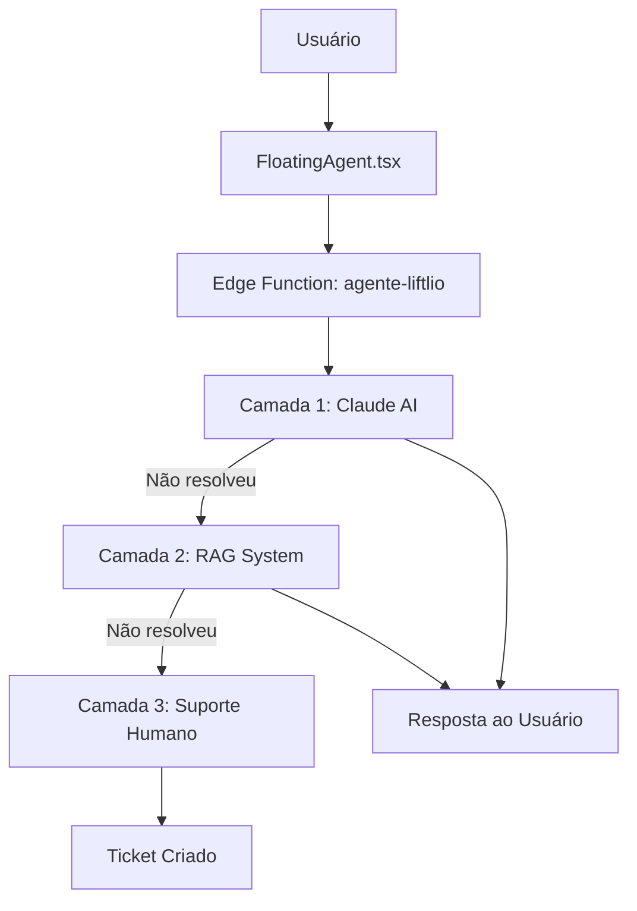

# 🏗️ Arquitetura do Agente Liftlio

## Visão Geral

O Agente Liftlio é um sistema de IA em 3 camadas que oferece suporte inteligente aos usuários.



## 🎯 Fluxo de Resolução

### 1. Usuário faz uma pergunta
- FloatingAgent captura o input
- Envia contexto (página atual, projeto)

### 2. Processamento em Camadas
```
Camada 1 (Claude AI) → 80% dos casos
    ↓ Se não resolver
Camada 2 (RAG) → 15% dos casos
    ↓ Se não resolver
Camada 3 (Suporte) → 5% dos casos
```

### 3. Resposta ao Usuário
- Resposta direta da IA
- Ação no sistema (navegação)
- Criação de ticket se necessário

## 🔧 Componentes Técnicos

### Frontend
- **FloatingAgent.tsx**: Componente React principal
- **Posição**: Canto inferior direito
- **Estado**: Minimizado/Expandido

### Backend
- **Edge Functions**: Supabase Deno Runtime
- **Banco de Dados**: PostgreSQL com pgvector
- **APIs**: Claude (Anthropic) e OpenAI

### Integrações
- **Supabase Auth**: Identificação do usuário
- **Supabase Realtime**: Notificações
- **Stripe**: Contexto de pagamentos

## 📊 Dados e Contexto

### Informações Disponíveis
1. **Contexto da Sessão**
   - Página atual
   - Projeto selecionado
   - Histórico de navegação

2. **Dados do Projeto**
   - Vídeos monitorados
   - Comentários e menções
   - Configurações e integrações

3. **Dados do Usuário**
   - Plano de assinatura
   - Histórico de tickets
   - Preferências

## 🔐 Segurança

### Autenticação
- JWT via Supabase Auth
- RLS em todas as tabelas
- Isolamento por usuário

### API Keys
- Armazenadas no Supabase Vault
- Nunca expostas ao frontend
- Rotação periódica

### Privacidade
- Dados sensíveis não vão para embeddings
- Logs anonimizados
- LGPD compliance

## 🚀 Escalabilidade

### Performance
- Edge Functions com auto-scaling
- Cache de embeddings frequentes
- Índices HNSW para busca rápida

### Limites
- OpenAI: 3000 req/min
- Claude: Rate limits aplicados
- Batch processing para embeddings

### Monitoramento
- Logs no Supabase Dashboard
- Métricas de uso por camada
- Alertas de falha

---

*Para detalhes de implementação, consulte a documentação de cada camada.*