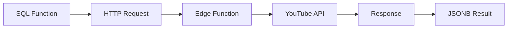

# Edge Functions de Monitoramento

Esta pasta contém funções SQL que fazem chamadas para Edge Functions do Supabase relacionadas ao monitoramento de canais do YouTube.

## 📡 Funções de Integração com YouTube API

### 1. **call_youtube_channel_details.sql**
- **Edge Function**: `Canal_youtube_dados`
- **Endpoint**: `/functions/v1/Canal_youtube_dados`
- **Descrição**: Obtém detalhes completos de um canal do YouTube
- **Parâmetros**:
  - `channel_id` (TEXT): ID do canal do YouTube
- **Retorno**: JSONB com informações do canal (nome, inscritos, visualizações, etc.)

### 2. **call_youtube_channel_monitor.sql**
- **Edge Function**: `monitormanto_de_canal`
- **Endpoint**: `/functions/v1/monitormanto_de_canal`
- **Descrição**: Monitora novos vídeos de um canal
- **Parâmetros**:
  - `channel_id` (TEXT): ID do canal
  - `time_filter` (TEXT): 'today' ou 'week'
  - `simple_response` (BOOLEAN): Se true, retorna apenas IDs
- **Retorno**: JSONB com vídeos novos ou "NOT" se não houver

### 3. **call_api_edge_function.sql**
- **Edge Function**: `Analise_de_videos_novos_do_canal`
- **Endpoint**: `/functions/v1/Analise_de_videos_novos_do_canal`
- **Descrição**: Analisa vídeos novos de um canal para potencial de leads
- **Parâmetros**:
  - `input_value` (TEXT): Dados de entrada para análise
- **Retorno**: JSONB com análise dos vídeos

## 🔧 Configuração

Todas as funções usam:
- **Timeout**: 60 segundos
- **Auth**: Bearer token do Supabase
- **Error handling**: Reset de CURL options em caso de erro

## 📊 Fluxo de Dados



## ⚠️ Tratamento de Erros

As funções verificam:
1. Status HTTP (deve ser 200)
2. Parsing do JSON de resposta
3. Reset de configurações CURL

## 🔑 Autenticação

Token Anon Key usado:
```
eyJhbGciOiJIUzI1NiIsInR5cCI6IkpXVCJ9...
```

## 📝 Logs

Todas as funções geram logs com `RAISE NOTICE` para debug:
- Request enviado
- Status da resposta
- Corpo da resposta