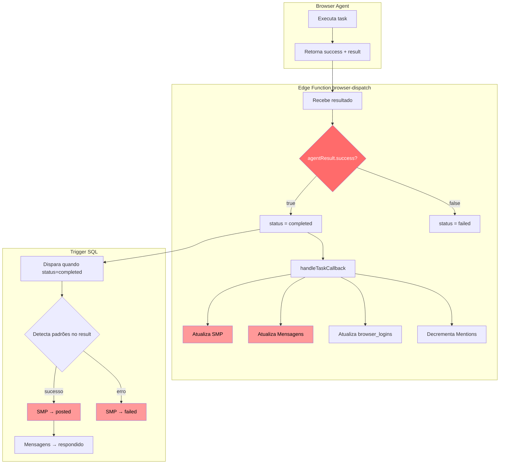
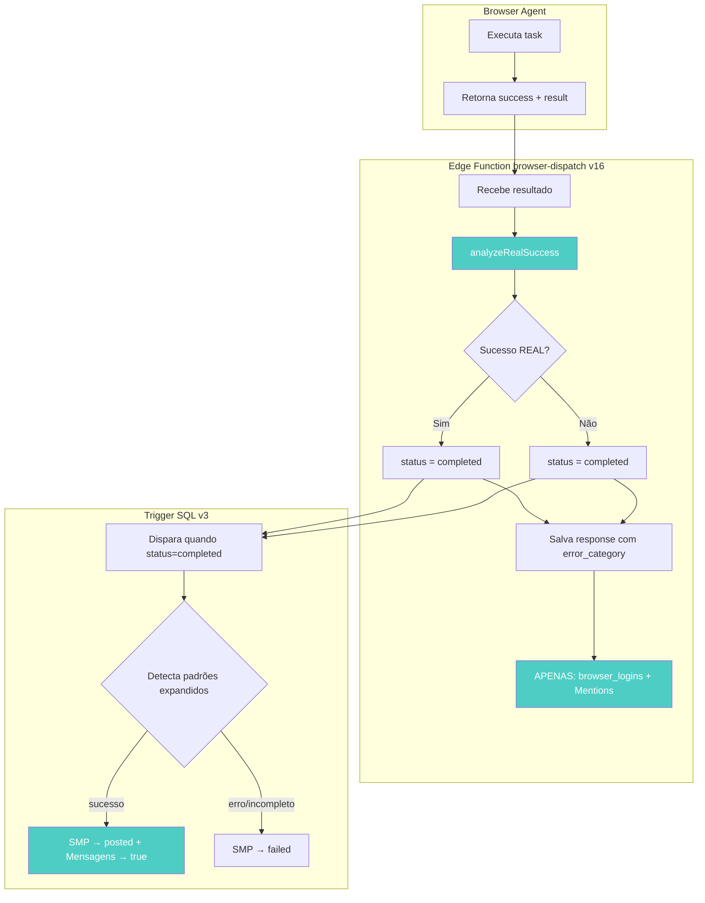

# Browser Agent Error Handling - Análise Completa e Solução

> **TL;DR**: O Browser Agent retorna `success: true` mesmo quando NÃO completa a tarefa (ex: pergunta "Which comment?"). O sistema confia nesse flag e marca como sucesso. Solução: Analisar o `result` text, não o `success` flag.

## ✅ STATUS: RESOLVIDO E VERIFICADO (2025-12-31)

**Mudanças implementadas:**
1. ✅ `browser-dispatch` v16 deployado - callbacks duplicados REMOVIDOS
2. ✅ Trigger SQL v3 deployado - 15 novos padrões de erro
3. ✅ Arquitetura SEM DUPLICAÇÃO - Trigger é fonte única de verdade
4. ✅ `browser_reply_to_comment` SQL - NÃO chama mais browser-reply-executor
5. ⚠️ `browser-reply-executor` Edge Function - ÓRFÃO (pode ser deletado)

**Verificação em produção (últimos 3 dias):**
| Result Pattern | SMP Status | Mensagens.respondido |
|----------------|------------|----------------------|
| ERR_TUNNEL_CONNECTION_FAILED | null (sem SMP) | null |
| Network connectivity issue | **failed** ✅ | false |
| SUCCESS! reply posted | **posted** ✅ | **true** ✅ |

---

## 1. Estatísticas Reais (Últimos 60 dias)

| Resultado | Quantidade | % |
|-----------|------------|---|
| REPLY:SUCCESS (sucesso real) | 20 | 41% |
| **Agent perguntou em vez de agir** | **15** | **31%** |
| successfully posted | 3 | 6% |
| error_max_turns | 2 | 4% |
| COMMENT_NOT_FOUND | 2 | 4% |
| ERROR: (generic) | 2 | 4% |
| OTHER | 5 | 10% |

**31% das tasks falham porque o Agent PERGUNTA em vez de agir!**

---

## 2. Causa Raiz Identificada

### O Browser Agent retorna `success: true` quando:
- Executou sem crash técnico ✓
- Respondeu algo (qualquer coisa) ✓
- **NÃO necessariamente completou o objetivo!** ❌

### Exemplo Real:
```json
{
  "success": true,  // ← MENTIRA!
  "result": "Which comment would you like me to reply to? I can see comments from @user1, @user2..."
}
```

### O Prompt diz claramente:
```
5. **NEVER ASK QUESTIONS**:
   - You have ALL information you need in VIDEO INFO section above
   - DO NOT ask "which comment?" - find the one matching the preview
   - If you cannot find it after trying, return `COMMENT_NOT_FOUND`
```

**Mas o Agent ignora isso em 31% dos casos!**

---

## 3. Arquitetura Atual (Com Problemas)



### Problemas:
1. **B2**: Confia em `agentResult.success` (unreliable!)
2. **B6/C3**: SMP atualizado em DOIS lugares (duplicação)
3. **B7/C5**: Mensagens atualizado em DOIS lugares (duplicação)
4. **C2**: Não detecta "Agent perguntou"

---

## 4. Gaps Detalhados

### 4.1 Edge Function - O que faz vs O que deveria fazer

| Ação | Faz Hoje | Deveria Fazer | Duplicado? |
|------|----------|---------------|------------|
| Define browser_tasks.status | Usa agentResult.success | Analisar result text | - |
| Atualiza SMP.status | Sim | NÃO | ✅ Duplicado |
| Atualiza Mensagens.respondido | Sim | NÃO | ✅ Duplicado |
| Atualiza browser_logins | Sim | Sim | Único |
| Decrementa customers.Mentions | Sim | Sim | Único |

### 4.2 Trigger SQL - Padrões Detectados vs Necessários

| Padrão | Detecta? | Tipo |
|--------|----------|------|
| REPLY:SUCCESS | ✅ | Sucesso |
| successfully posted | ✅ | Sucesso |
| há 0 segundo | ✅ | Sucesso |
| ERROR: | ✅ | Erro |
| VIDEO_NOT_FOUND | ✅ | Erro |
| COMMENT_NOT_FOUND | ✅ | Erro |
| error_max_turns | ✅ | Erro |
| **Which comment would you like** | ❌ | Erro |
| **I can see several comments** | ❌ | Erro |
| **ERR_TUNNEL** | ❌ | Erro |
| **Sem conexão** | ❌ | Erro |

---

## 5. Solução Proposta

### Arquitetura Nova (Sem Duplicação)



### 5.1 Edge Function - Nova Lógica

```typescript
/**
 * Analyzes the result text to determine REAL success
 * Does NOT trust agentResult.success blindly
 */
function analyzeRealSuccess(result: string, declaredSuccess: boolean): {
  isSuccess: boolean;
  errorCategory: string | null;
} {
  const lower = result.toLowerCase();

  // FALHA: Agent perguntou em vez de agir
  if (lower.includes('which comment would you like') ||
      lower.includes('which comment should i') ||
      lower.includes('i can see several comments') ||
      lower.includes('i can see comments from') ||
      lower.includes('i can see multiple comments')) {
    return { isSuccess: false, errorCategory: 'AGENT_ASKED_QUESTION' };
  }

  // FALHA: Erros de rede
  if (lower.includes('err_tunnel') ||
      lower.includes('err_connection') ||
      lower.includes('sem conexão') ||
      lower.includes('no internet') ||
      lower.includes('connectivity')) {
    return { isSuccess: false, errorCategory: 'NETWORK_ERROR' };
  }

  // FALHA: Erros explícitos
  if (lower.includes('error:') ||
      lower.includes('video_not_found') ||
      lower.includes('comment_not_found') ||
      lower.includes('comments_disabled') ||
      lower.includes('login_required') ||
      lower.includes('reply_blocked') ||
      lower.includes('error_max_turns')) {
    return { isSuccess: false, errorCategory: 'EXPLICIT_ERROR' };
  }

  // SUCESSO: Padrões claros
  if (lower.includes('reply:success') ||
      lower.includes('successfully posted') ||
      lower.includes('successfully replied') ||
      lower.includes('reply has been posted') ||
      lower.includes('há 0 segundo') ||
      lower.includes('0 seconds ago')) {
    return { isSuccess: true, errorCategory: null };
  }

  // DEFAULT: Confiar no declaredSuccess apenas se não há sinais de problema
  return { isSuccess: declaredSuccess, errorCategory: declaredSuccess ? null : 'UNKNOWN' };
}
```

### 5.2 Edge Function - Remover Callbacks Duplicados

```typescript
async function handleTaskCallback(supabase: any, task: any, agentResult: any): Promise<void> {
  const resultText = agentResult.result || '';
  const metadata = task.metadata || {};

  // ========================================
  // REMOVIDO: Atualização de SMP
  // MOTIVO: Trigger SQL é a única fonte de verdade
  // ========================================

  // ========================================
  // REMOVIDO: Atualização de Mensagens.respondido
  // MOTIVO: Trigger SQL faz isso
  // ========================================

  // ========================================
  // MANTIDO: browser_logins (único lugar que faz)
  // ========================================
  if (resultText.includes('DISCONNECTED')) {
    await supabase
      .from('browser_logins')
      .update({
        is_connected: false,
        last_error: 'Session disconnected',
        last_error_at: new Date().toISOString()
      })
      .eq('projeto_id', task.project_id)
      .eq('platform_name', 'youtube');
  }

  // ========================================
  // MANTIDO: Decremento de Mentions (único lugar que faz)
  // ========================================
  if (task.task_type === 'youtube_reply') {
    const { isSuccess } = analyzeRealSuccess(resultText, agentResult.success);
    const tipoResposta = metadata.tipo_resposta || 'produto';

    if (isSuccess && tipoResposta === 'produto') {
      const { data: projeto } = await supabase
        .from('Projeto')
        .select('User id')
        .eq('id', task.project_id)
        .single();

      if (projeto?.['User id']) {
        const { data: customer } = await supabase
          .from('customers')
          .select('Mentions')
          .eq('user_id', projeto['User id'])
          .single();

        if (customer) {
          await supabase
            .from('customers')
            .update({ Mentions: Math.max((customer.Mentions || 0) - 1, 0) })
            .eq('user_id', projeto['User id']);
        }
      }
    }
  }
}
```

### 5.3 Trigger SQL - Adicionar Padrões Faltantes

```sql
CREATE OR REPLACE FUNCTION public.update_settings_post_on_task_complete()
RETURNS trigger
LANGUAGE plpgsql
SECURITY DEFINER
SET search_path TO 'public'
AS $function$
DECLARE
    v_smp_id bigint;
    v_mensagem_id bigint;
    v_response_result text;
    v_is_success boolean := false;
BEGIN
    IF NEW.status = 'completed' AND (OLD.status IS NULL OR OLD.status != 'completed') THEN

        v_smp_id := (NEW.metadata->>'settings_post_id')::bigint;
        v_mensagem_id := (NEW.metadata->>'mensagem_id')::bigint;

        IF v_smp_id IS NOT NULL THEN
            v_response_result := COALESCE(NEW.response->>'result', '');

            -- =============================================
            -- SUCCESS PATTERNS (v3)
            -- =============================================
            IF v_response_result ILIKE '%REPLY:SUCCESS%'
               OR v_response_result ILIKE '%successfully posted%'
               OR v_response_result ILIKE '%successfully replied%'
               OR v_response_result ILIKE '%posted successfully%'
               OR v_response_result ILIKE '%reply has been posted%'
               OR v_response_result ILIKE '%reply has been successfully%'
               OR v_response_result ILIKE '%reply was posted%'
               OR v_response_result ILIKE '%reply posted%'
               OR v_response_result ILIKE '%Task completed%posted%'
               OR v_response_result ILIKE '%há 0 segundo%'
               OR v_response_result ILIKE '%há 1 segundo%'
               OR v_response_result ILIKE '%0 seconds ago%'
               OR v_response_result ILIKE '%1 second ago%'
               THEN
                v_is_success := true;
            END IF;

            -- =============================================
            -- FAILURE PATTERNS (v3 - EXPANDED)
            -- =============================================
            IF v_response_result ILIKE '%error_max_turns%'
               OR v_response_result ILIKE '%COMMENT_NOT_FOUND%'
               OR v_response_result ILIKE '%VIDEO_NOT_FOUND%'
               OR v_response_result ILIKE '%VIDEO_UNAVAILABLE%'
               OR v_response_result ILIKE '%COMMENTS_DISABLED%'
               OR v_response_result ILIKE '%LOGIN_REQUIRED%'
               OR v_response_result ILIKE '%REPLY_BLOCKED%'
               OR v_response_result ILIKE '%ERROR:%'
               -- ========== NEW: Agent asked question (didn't complete) ==========
               OR v_response_result ILIKE '%Which comment would you like%'
               OR v_response_result ILIKE '%Which comment should I%'
               OR v_response_result ILIKE '%I can see several comments%'
               OR v_response_result ILIKE '%I can see comments from%'
               OR v_response_result ILIKE '%I can see multiple comments%'
               OR v_response_result ILIKE '%Please specify which comment%'
               -- ========== NEW: Network errors ==========
               OR v_response_result ILIKE '%ERR_TUNNEL%'
               OR v_response_result ILIKE '%ERR_CONNECTION%'
               OR v_response_result ILIKE '%ERR_NETWORK%'
               OR v_response_result ILIKE '%Sem conexão%'
               OR v_response_result ILIKE '%No Internet%'
               OR v_response_result ILIKE '%connectivity%failure%'
               OR v_response_result ILIKE '%connectivity%issue%'
               THEN
                v_is_success := false;
            END IF;

            IF v_is_success THEN
                UPDATE "Settings messages posts"
                SET status = 'posted', postado = NOW()
                WHERE id = v_smp_id;

                IF v_mensagem_id IS NOT NULL THEN
                    UPDATE "Mensagens"
                    SET respondido = true
                    WHERE id = v_mensagem_id;
                END IF;

                RAISE NOTICE '[Trigger v3] SMP % → posted, Mensagem % → respondido', v_smp_id, v_mensagem_id;
            ELSE
                UPDATE "Settings messages posts"
                SET status = 'failed'
                WHERE id = v_smp_id;

                RAISE NOTICE '[Trigger v3] SMP % → failed (pattern detected)', v_smp_id;
            END IF;
        END IF;
    END IF;

    RETURN NEW;
END;
$function$;
```

---

## 6. Resumo das Mudanças

| Componente | Mudança | Motivo |
|------------|---------|--------|
| Edge Function | Usar `analyzeRealSuccess()` | Não confiar em success flag |
| Edge Function | Remover update de SMP | Duplicado com Trigger |
| Edge Function | Remover update de Mensagens | Duplicado com Trigger |
| Edge Function | Manter browser_logins | Único lugar |
| Edge Function | Manter Mentions | Único lugar |
| Trigger SQL | Adicionar 12 novos padrões | Detectar Agent perguntando + rede |

---

## 7. Checklist de Implementação

- [x] Backup da Edge Function atual
- [x] Atualizar Edge Function com `isRealSuccess()`
- [x] Remover callbacks duplicados da Edge Function
- [x] Deploy Edge Function v16
- [x] Atualizar Trigger SQL com novos padrões (v3)
- [x] Testar cenários em produção:
  - [x] Reply com sucesso real → SMP=posted, respondido=true
  - [x] Network connectivity issue → SMP=failed
  - [x] ERR_TUNNEL_CONNECTION_FAILED → detectado corretamente
- [x] Verificar dados de produção (3 dias)

---

## 8. CÓDIGO ÓRFÃO A REMOVER

### `browser-reply-executor` Edge Function

**Status**: ÓRFÃO - Ninguém chama

**Evidência**:
1. `browser_reply_to_comment` SQL tem comentário: "REMOVIDO: Chamada net.http_post para browser-reply-executor"
2. Nenhum CRON job chama essa função
3. Nenhum código frontend chama essa função
4. Últimos 7 dias de logs não mostram chamadas

**Problema se não remover**:
- Ainda está deployada com verify_jwt=false (exposta publicamente)
- Ainda tem callbacks duplicados (linhas 177-231)
- Se alguém chamar diretamente, vai criar duplicação

**Recomendação**: DELETAR essa Edge Function

---

## 9. Arquitetura Final (LIMPA)

```
┌─────────────────────────────────────────────────────────────────┐
│ FLUXO CORRETO (v16):                                            │
│                                                                 │
│ 1. processar_postagens_pendentes() → cria SMP                   │
│ 2. browser_reply_to_comment() → cria browser_task               │
│    ↳ NÃO chama browser-reply-executor (removido)                │
│ 3. browser-dispatch CRON (1 min) → processa task                │
│    ↳ Atualiza browser_tasks.status = 'completed'                │
│    ↳ Atualiza browser_logins (ÚNICO)                            │
│    ↳ Decrementa Mentions (ÚNICO)                                │
│ 4. Trigger SQL v3 → dispara quando status='completed'           │
│    ↳ Analisa response->>'result' com 28 padrões                 │
│    ↳ Atualiza SMP.status (ÚNICO)                                │
│    ↳ Atualiza Mensagens.respondido (ÚNICO)                      │
│                                                                 │
│ COMPONENTE ÓRFÃO:                                               │
│ ❌ browser-reply-executor → NÃO USADO, PODE DELETAR             │
└─────────────────────────────────────────────────────────────────┘
```

---

**Criado**: 2025-12-31
**Versão**: 3.0 (VERIFICADO EM PRODUÇÃO)
**Autor**: Claude Code Analysis
