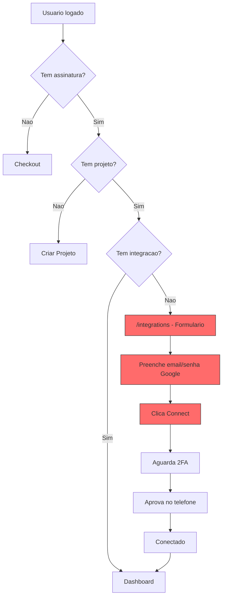
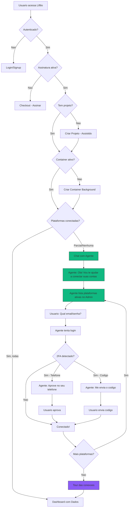
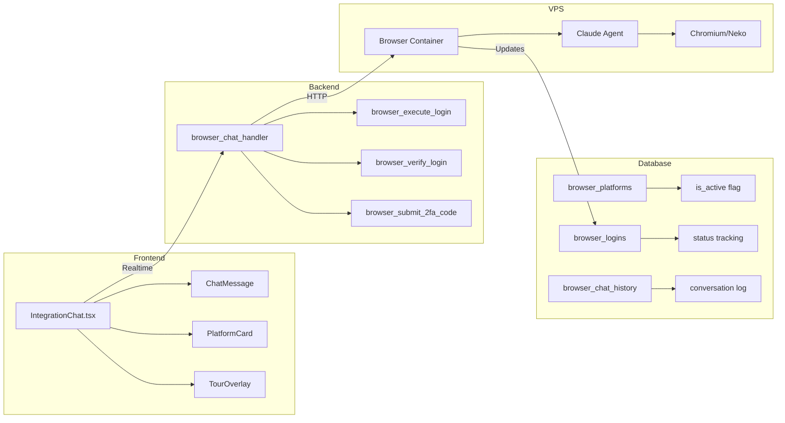
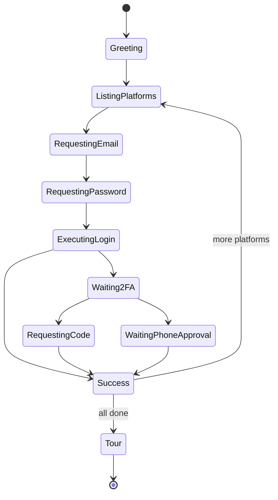

# Browser Integration Redesign v2 - Fluxo Assistido por Agente

> **TL;DR**: Redesign completo do fluxo de integração para ser conversacional e assistido pelo agente do navegador. O usuário interage diretamente com o agente que guia todo o processo de login nas plataformas.

---

## 1. Fluxo Atual vs Proposto

### 1.1 Fluxo ATUAL (Formulário)



**Problemas do Fluxo Atual:**
- UI de formulario tradicional (nao conversacional)
- Usuario precisa navegar entre paginas
- Nao tem orientacao/guia do agente
- Plataformas hardcoded (Google -> YouTube -> outras)
- Nao mostra progresso claro
- Sem tour/onboarding apos conexao

---

### 1.2 Fluxo PROPOSTO (Conversacional)



---

## 2. Arquitetura do Novo Sistema

### 2.1 Componentes Principais



### 2.2 Nova Tabela: browser_chat_history

```sql
CREATE TABLE browser_chat_history (
    id UUID PRIMARY KEY DEFAULT gen_random_uuid(),
    projeto_id INTEGER REFERENCES "Projeto"(id),
    user_message TEXT,
    agent_message TEXT,
    message_type TEXT, -- 'greeting', 'platform_list', 'credential_request', '2fa_request', 'success', 'error'
    platform_name TEXT,
    created_at TIMESTAMPTZ DEFAULT NOW()
);
```

---

## 3. Fluxo Detalhado do Chat

### 3.1 Inicio da Conversa

```
AGENTE: Ola! Sou o assistente do Liftlio. Vou te ajudar a conectar suas contas para comecarmos a monitorar seus videos.

Encontrei 3 plataformas disponiveis para conexao:
- Google/YouTube (obrigatorio)
- Reddit
- LinkedIn

Vamos comecar pelo Google? Me informe seu email:
```

### 3.2 Solicitacao de Credenciais

```
USUARIO: valdair3d@gmail.com

AGENTE: Otimo! Agora preciso da sua senha do Google:
[Input seguro com mascara]
```

### 3.3 Processo de Login

```
AGENTE: Iniciando login... Aguarde um momento.
[Animacao de progresso]

AGENTE: O Google detectou um novo dispositivo e enviou uma notificacao
para seu telefone. Por favor, aprove o acesso.

[Icone de telefone vibrando]
[Botao: Ja aprovei]
```

### 3.4 Codigo 2FA

```
AGENTE: Parece que sua conta tem verificacao em duas etapas.
Por favor, insira o codigo enviado por SMS ou do seu app autenticador:

[Input para codigo]
```

### 3.5 Sucesso

```
AGENTE: Perfeito! Google conectado com sucesso!
YouTube tambem foi conectado automaticamente via SSO.

Proximo: Reddit. Deseja conectar agora?
[Sim] [Pular por enquanto]
```

### 3.6 Tour Final

```
AGENTE: Todas as plataformas foram conectadas!

Aqui esta um resumo:
- Google: Conectado
- YouTube: Conectado (via SSO)
- Reddit: Conectado

Agora vou comecar a monitorar seus videos.
Os dados aparecerao no dashboard em alguns minutos.

[Ir para o Dashboard]
```

---

## 4. Mudancas no Admin

### 4.1 Gerenciamento de Plataformas

O admin ja tem a tabela `browser_platforms` com:
- `is_active` - controla quais plataformas aparecem para usuarios
- `login_prompt`, `twofa_phone_prompt`, etc - prompts do Claude

**Novo campo sugerido:**
```sql
ALTER TABLE browser_platforms
ADD COLUMN display_order INTEGER DEFAULT 100,
ADD COLUMN is_required BOOLEAN DEFAULT false,
ADD COLUMN chat_greeting TEXT;
```

### 4.2 Visualizacao no Admin

- Lista de plataformas ativas
- Toggle para ativar/desativar
- Preview do fluxo de chat
- Estatisticas de conexao por plataforma

---

## 5. API do Agente de Chat

### 5.1 Endpoint Principal

```typescript
// POST /functions/v1/browser-chat
{
  project_id: number,
  message: string,
  context?: {
    current_platform?: string,
    waiting_for?: 'email' | 'password' | '2fa_code' | 'phone_approval',
    credentials?: { email?: string }
  }
}

// Response
{
  agent_message: string,
  message_type: 'greeting' | 'platform_list' | 'credential_request' | '2fa_request' | 'success' | 'error',
  action?: 'request_email' | 'request_password' | 'start_login' | 'wait_2fa' | 'request_code' | 'complete',
  platform?: string,
  progress?: { connected: string[], pending: string[] }
}
```

### 5.2 Estados do Chat



---

## 6. Componentes React

### 6.1 IntegrationChat.tsx (Novo)

```typescript
interface IntegrationChatProps {
  onComplete: () => void;
}

// Estados:
// - platforms: BrowserPlatform[] (do admin)
// - messages: ChatMessage[]
// - currentPlatform: string | null
// - waitingFor: 'email' | 'password' | '2fa_code' | 'phone_approval' | null
// - connected: string[]

// Componentes internos:
// - MessageBubble (agente vs usuario)
// - PlatformProgress (checkmarks)
// - SecureInput (senha/codigo)
// - PhoneApprovalAnimation
// - TourCarousel
```

### 6.2 Integracao com App.tsx

```typescript
// Atual:
<Route path="/integrations" element={<Integrations />} />
<Route path="/browser-integrations" element={<BrowserIntegrations />} />

// Proposto:
<Route path="/integrations" element={<IntegrationChat />} />
// browser-integrations deprecated ou redirecionado
```

---

## 7. Impacto e Beneficios

### 7.1 Experiencia do Usuario

| Aspecto | Atual | Proposto |
|---------|-------|----------|
| Tipo de UI | Formulario tradicional | Chat conversacional |
| Orientacao | Nenhuma | Agente guia cada passo |
| Feedback | Mensagens de status | Conversa natural |
| Progresso | Steps lineares | Checkmarks + chat |
| Onboarding | Nenhum | Tour interativo |
| Erros | Alertas tecnicos | Explicacoes amigaveis |

### 7.2 Metricas Esperadas

- **Conversao de integracao**: +40% (menos abandono)
- **Tempo de setup**: -30% (menos confusao)
- **Tickets de suporte**: -50% (agente resolve duvidas)
- **NPS**: +20 pontos (experiencia mais amigavel)

---

## 8. Checklist de Implementacao

### Fase 1: Backend (1-2 dias)
- [ ] Criar tabela `browser_chat_history`
- [ ] Criar Edge Function `browser-chat`
- [ ] Adaptar prompts existentes para formato chat
- [ ] Adicionar campo `display_order` em `browser_platforms`

### Fase 2: Frontend (2-3 dias)
- [ ] Criar componente `IntegrationChat.tsx`
- [ ] Criar componente `ChatMessage.tsx`
- [ ] Criar componente `PlatformProgress.tsx`
- [ ] Criar componente `TourOverlay.tsx`
- [ ] Integrar Realtime para updates

### Fase 3: Fluxo (1 dia)
- [ ] Atualizar `App.tsx` para usar novo fluxo
- [ ] Atualizar `ProjectContext` para detectar estado de chat
- [ ] Atualizar `SubscriptionGate` se necessario

### Fase 4: Admin (0.5 dia)
- [ ] Adicionar preview do chat no admin
- [ ] Adicionar metricas de conversao

### Fase 5: Testes (1 dia)
- [ ] Testar fluxo completo Google -> YouTube
- [ ] Testar 2FA telefone
- [ ] Testar 2FA codigo
- [ ] Testar multiplas plataformas
- [ ] Testar erros e recuperacao

---

## 9. Codigo de Exemplo

### 9.1 IntegrationChat.tsx (Estrutura Base)

```typescript
import React, { useState, useEffect, useRef } from 'react';
import styled from 'styled-components';
import { supabase } from '../lib/supabaseClient';
import { useProject } from '../context/ProjectContext';

const IntegrationChat: React.FC = () => {
  const { currentProject } = useProject();
  const [messages, setMessages] = useState<Message[]>([]);
  const [platforms, setPlatforms] = useState<Platform[]>([]);
  const [input, setInput] = useState('');
  const [inputType, setInputType] = useState<'text' | 'password' | 'code'>('text');
  const [waitingFor, setWaitingFor] = useState<string | null>(null);
  const chatEndRef = useRef<HTMLDivElement>(null);

  // Carregar plataformas ativas do admin
  useEffect(() => {
    const loadPlatforms = async () => {
      const { data } = await supabase
        .from('browser_platforms')
        .select('*')
        .eq('is_active', true)
        .order('display_order');

      if (data) {
        setPlatforms(data);
        // Enviar mensagem inicial
        sendAgentMessage({
          text: `Ola! Vou te ajudar a conectar ${data.length} plataformas.`,
          type: 'greeting'
        });
      }
    };
    loadPlatforms();
  }, []);

  const sendMessage = async (text: string) => {
    // Adicionar mensagem do usuario
    setMessages(prev => [...prev, { sender: 'user', text }]);
    setInput('');

    // Enviar para backend
    const { data } = await supabase.functions.invoke('browser-chat', {
      body: {
        project_id: currentProject?.id,
        message: text,
        context: { waiting_for: waitingFor }
      }
    });

    // Processar resposta do agente
    handleAgentResponse(data);
  };

  const handleAgentResponse = (response: AgentResponse) => {
    setMessages(prev => [...prev, {
      sender: 'agent',
      text: response.agent_message,
      type: response.message_type
    }]);

    // Atualizar estado baseado na acao
    switch (response.action) {
      case 'request_email':
        setInputType('text');
        setWaitingFor('email');
        break;
      case 'request_password':
        setInputType('password');
        setWaitingFor('password');
        break;
      case 'request_code':
        setInputType('code');
        setWaitingFor('2fa_code');
        break;
      case 'wait_2fa':
        setWaitingFor('phone_approval');
        break;
      case 'complete':
        // Mostrar tour ou ir para dashboard
        break;
    }
  };

  return (
    <ChatContainer>
      <ChatHeader>
        <h2>Conectar Plataformas</h2>
        <PlatformProgress platforms={platforms} />
      </ChatHeader>

      <MessagesContainer>
        {messages.map((msg, i) => (
          <MessageBubble key={i} $sender={msg.sender}>
            {msg.text}
          </MessageBubble>
        ))}
        <div ref={chatEndRef} />
      </MessagesContainer>

      {waitingFor === 'phone_approval' ? (
        <PhoneApprovalUI onApproved={() => sendMessage('aprovei')} />
      ) : (
        <InputContainer>
          <ChatInput
            type={inputType}
            value={input}
            onChange={(e) => setInput(e.target.value)}
            placeholder={getPlaceholder(waitingFor)}
            onKeyPress={(e) => e.key === 'Enter' && sendMessage(input)}
          />
          <SendButton onClick={() => sendMessage(input)}>
            Enviar
          </SendButton>
        </InputContainer>
      )}
    </ChatContainer>
  );
};
```

---

## 10. Proximos Passos

1. **Validar fluxo com usuario**: Fazer um teste A/B ou mockup clicavel
2. **Priorizar plataformas**: Comecar com Google/YouTube, expandir depois
3. **Definir prompts de chat**: Trabalhar com copywriter para mensagens amigaveis
4. **Implementar backend primeiro**: Edge Function + SQL Functions
5. **Iterar no frontend**: Comecar simples, adicionar animacoes depois

---

## 11. Consideracoes Tecnicas

### 11.1 Seguranca
- Senhas nunca sao logadas no chat_history
- Credenciais sao enviadas apenas para a SQL function de login
- 2FA codes tem TTL de 5 minutos

### 11.2 Performance
- Realtime para updates instantaneos
- Lazy loading de mensagens antigas
- Container criado em background antes do chat

### 11.3 Fallback
- Se agente falhar, mostrar formulario tradicional
- Timeout de 2 minutos para qualquer operacao
- Retry automatico 3x antes de erro

---

*Documento criado em: 2025-12-31*
*Autor: Claude Code Agent*
*Status: PROPOSTA PARA REVISAO*
