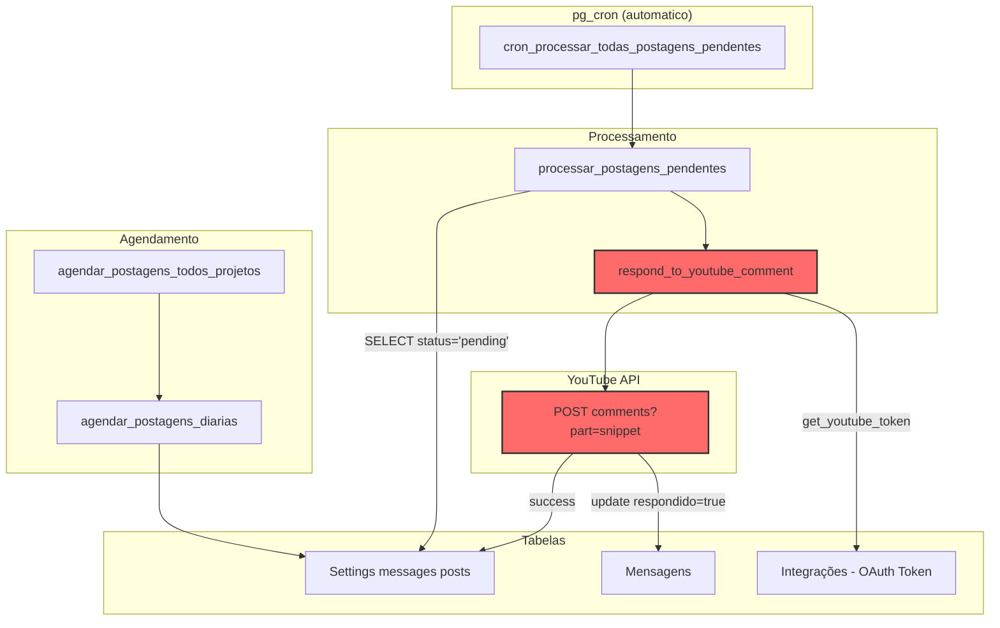
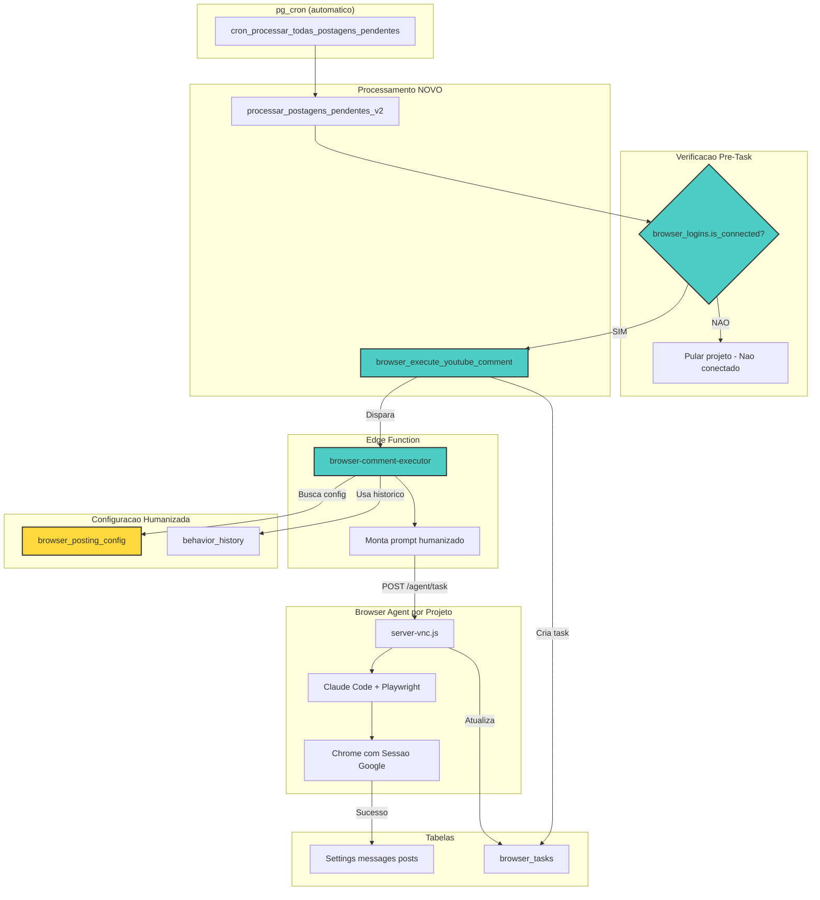
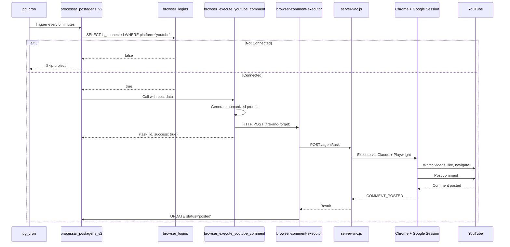

# Sistema de Postagem de Comentarios via Browser Agent

## Resposta: ARQUITETURA PROPOSTA

> **TL;DR**: Modificar `processar_postagens_pendentes` para usar Browser Agent em vez da API do YouTube. Criar tabela `browser_posting_config` para comportamentos humanizados e verificar `browser_logins.is_connected` antes de enviar tasks.

---

## 1. Fluxo ATUAL (API Direta)



**Problemas do Fluxo Atual:**
- API direta pode ser detectada como bot
- Sem comportamento humanizado
- Bans frequentes (403 Forbidden)
- Nao simula navegacao real

---

## 2. Fluxo PROPOSTO (Browser Agent)



---

## 3. Tabelas Necessarias

### 3.1 Tabela: `browser_posting_config` (NOVA)

```sql
CREATE TABLE browser_posting_config (
    id BIGSERIAL PRIMARY KEY,
    projeto_id BIGINT NOT NULL REFERENCES "Projeto"(id) ON DELETE CASCADE,
    platform_name TEXT NOT NULL DEFAULT 'youtube',

    -- Comportamento Humanizado
    watch_other_videos BOOLEAN DEFAULT true,
    watch_other_count INTEGER DEFAULT 2,
    watch_speed DECIMAL(2,1) DEFAULT 2.0,
    like_videos BOOLEAN DEFAULT true,
    read_comments_before BOOLEAN DEFAULT true,
    read_comments_count INTEGER DEFAULT 5,

    -- Variacao de Comportamento
    randomize_behavior BOOLEAN DEFAULT true,
    min_delay_seconds INTEGER DEFAULT 30,
    max_delay_seconds INTEGER DEFAULT 120,

    -- Prompt Template (substitui variaveis)
    comment_prompt_template TEXT NOT NULL DEFAULT '
## TASK: Post a natural comment on YouTube video

### BEHAVIOR INSTRUCTIONS (Simulate Human):
1. First, go to the channel: {{channel_url}}
2. Watch {{watch_count}} videos at {{watch_speed}}x speed (just let them play for 30-60 seconds each)
3. Like at least one video
4. Navigate to the target video: {{video_url}}
5. Watch the video for at least 60 seconds
6. Like the video
7. Scroll down to comments section
8. Read {{read_comments}} existing comments
9. Find the comment to reply to: "{{parent_comment_text}}"
10. Post this exact comment as a reply: "{{comment_text}}"
11. Wait for confirmation that comment was posted

### RESPONSE FORMAT:
- COMMENT_POSTED - Successfully posted
- VIDEO_NOT_FOUND - Could not find video
- COMMENT_NOT_FOUND - Could not find parent comment
- POSTING_BLOCKED - YouTube blocked the comment
- ERROR: [reason]
',

    -- Historico de comportamentos usados (para variar)
    behavior_history JSONB DEFAULT '[]'::jsonb,

    -- Controle
    is_active BOOLEAN DEFAULT true,
    created_at TIMESTAMPTZ DEFAULT now(),
    updated_at TIMESTAMPTZ DEFAULT now(),

    UNIQUE(projeto_id, platform_name)
);

-- Index para busca rapida
CREATE INDEX idx_browser_posting_config_projeto ON browser_posting_config(projeto_id);

-- Trigger para updated_at
CREATE OR REPLACE FUNCTION update_browser_posting_config_timestamp()
RETURNS TRIGGER AS $$
BEGIN
    NEW.updated_at = now();
    RETURN NEW;
END;
$$ LANGUAGE plpgsql;

CREATE TRIGGER trg_browser_posting_config_updated
BEFORE UPDATE ON browser_posting_config
FOR EACH ROW EXECUTE FUNCTION update_browser_posting_config_timestamp();

-- RLS
ALTER TABLE browser_posting_config ENABLE ROW LEVEL SECURITY;

CREATE POLICY browser_posting_config_select ON browser_posting_config
    FOR SELECT USING (true);

CREATE POLICY browser_posting_config_insert ON browser_posting_config
    FOR INSERT WITH CHECK (true);

CREATE POLICY browser_posting_config_update ON browser_posting_config
    FOR UPDATE USING (true);
```

### 3.2 Tabela: `browser_logins` (Existente - Campos Relevantes)

| Campo | Tipo | Descricao |
|-------|------|-----------|
| projeto_id | BIGINT | ID do projeto |
| platform_name | TEXT | 'youtube' ou 'google' |
| is_connected | BOOLEAN | **CRITICO**: Se esta logado |
| connected_at | TIMESTAMPTZ | Quando conectou |
| last_verified_at | TIMESTAMPTZ | Ultima verificacao |

### 3.3 Tabela: `browser_tasks` (Existente - Campos Relevantes)

| Campo | Tipo | Descricao |
|-------|------|-----------|
| id | UUID | ID da task |
| project_id | BIGINT | Projeto |
| task | TEXT | Prompt completo |
| task_type | TEXT | 'login', 'youtube_comment', etc |
| status | TEXT | 'pending', 'running', 'completed', 'failed' |
| response | JSONB | Resposta do agente |
| behavior_used | JSONB | **NOVO**: Comportamento usado (para historico) |

---

## 4. Funcoes SQL Necessarias

### 4.1 `browser_execute_youtube_comment` (NOVA)

```sql
-- Similar a browser_execute_login, mas para comentarios
CREATE OR REPLACE FUNCTION browser_execute_youtube_comment(
    p_post_id BIGINT,           -- ID do Settings messages posts
    p_project_id BIGINT,
    p_video_url TEXT,
    p_channel_url TEXT,
    p_parent_comment_text TEXT,
    p_comment_text TEXT
)
RETURNS jsonb
LANGUAGE plpgsql
SECURITY DEFINER
SET search_path = public
AS $$
DECLARE
    v_task_id uuid;
    v_browser_url text;
    v_is_connected boolean;
    v_config browser_posting_config%ROWTYPE;
    v_prompt text;
    v_behavior jsonb;
    v_supabase_url text := 'https://suqjifkhmekcdflwowiw.supabase.co';
    v_supabase_anon_key text := 'eyJhbGciOiJIUzI1NiIsInR5cCI6IkpXVCJ9...';
BEGIN
    -- 1. VERIFICAR CONEXAO (CRITICO!)
    SELECT is_connected INTO v_is_connected
    FROM browser_logins
    WHERE projeto_id = p_project_id
    AND platform_name = 'youtube'
    AND is_active = true
    LIMIT 1;

    IF v_is_connected IS NULL OR v_is_connected = false THEN
        RETURN jsonb_build_object(
            'success', false,
            'error', 'YouTube not connected. Please login first.',
            'code', 'NOT_CONNECTED'
        );
    END IF;

    -- 2. Buscar browser_mcp_url do projeto
    SELECT browser_mcp_url INTO v_browser_url
    FROM "Projeto"
    WHERE id = p_project_id;

    IF v_browser_url IS NULL THEN
        RETURN jsonb_build_object(
            'success', false,
            'error', 'Project has no browser_mcp_url configured'
        );
    END IF;

    -- 3. Buscar configuracao de comportamento
    SELECT * INTO v_config
    FROM browser_posting_config
    WHERE projeto_id = p_project_id
    AND platform_name = 'youtube'
    AND is_active = true;

    -- Se nao existe config, usar valores padrao
    IF v_config.id IS NULL THEN
        v_config.watch_other_videos := true;
        v_config.watch_other_count := 2;
        v_config.watch_speed := 2.0;
        v_config.like_videos := true;
        v_config.read_comments_before := true;
        v_config.read_comments_count := 5;
    END IF;

    -- 4. Gerar comportamento randomizado
    v_behavior := jsonb_build_object(
        'watch_count', CASE WHEN v_config.randomize_behavior
            THEN floor(random() * 3) + 1  -- 1-3 videos
            ELSE v_config.watch_other_count END,
        'watch_speed', v_config.watch_speed,
        'read_comments', CASE WHEN v_config.randomize_behavior
            THEN floor(random() * 5) + 3  -- 3-7 comments
            ELSE v_config.read_comments_count END,
        'delay_before_post', floor(random() *
            (v_config.max_delay_seconds - v_config.min_delay_seconds) +
            v_config.min_delay_seconds)
    );

    -- 5. Montar prompt substituindo variaveis
    v_prompt := COALESCE(v_config.comment_prompt_template,
        'Go to {{video_url}} and post comment: {{comment_text}}');

    v_prompt := replace(v_prompt, '{{channel_url}}', COALESCE(p_channel_url, ''));
    v_prompt := replace(v_prompt, '{{video_url}}', p_video_url);
    v_prompt := replace(v_prompt, '{{parent_comment_text}}',
        COALESCE(p_parent_comment_text, ''));
    v_prompt := replace(v_prompt, '{{comment_text}}', p_comment_text);
    v_prompt := replace(v_prompt, '{{watch_count}}',
        (v_behavior->>'watch_count')::text);
    v_prompt := replace(v_prompt, '{{watch_speed}}',
        (v_behavior->>'watch_speed')::text);
    v_prompt := replace(v_prompt, '{{read_comments}}',
        (v_behavior->>'read_comments')::text);

    -- 6. Criar task em browser_tasks
    INSERT INTO browser_tasks (
        project_id,
        task,
        task_type,
        status,
        priority,
        behavior_used
    )
    VALUES (
        p_project_id,
        v_prompt,
        'youtube_comment',
        'pending',
        2,  -- Prioridade media
        v_behavior
    )
    RETURNING id INTO v_task_id;

    -- 7. Disparar Edge Function (fire-and-forget)
    PERFORM net.http_post(
        url := v_supabase_url || '/functions/v1/browser-comment-executor',
        headers := jsonb_build_object(
            'Content-Type', 'application/json',
            'Authorization', 'Bearer ' || v_supabase_anon_key
        ),
        body := jsonb_build_object(
            'task_id', v_task_id::text,
            'post_id', p_post_id,
            'project_id', p_project_id,
            'browser_url', v_browser_url,
            'prompt', v_prompt,
            'behavior', v_behavior
        ),
        timeout_milliseconds := 5000
    );

    -- 8. Retornar imediatamente
    RETURN jsonb_build_object(
        'success', true,
        'task_id', v_task_id,
        'message', 'Comment task queued. Browser agent will process.',
        'behavior', v_behavior
    );

EXCEPTION WHEN OTHERS THEN
    RETURN jsonb_build_object(
        'success', false,
        'error', SQLERRM
    );
END;
$$;
```

### 4.2 `processar_postagens_pendentes_v2` (Modificacao)

```sql
-- Versao que usa Browser Agent em vez de API direta
-- Principais mudancas:
-- 1. Verifica is_connected ANTES de processar
-- 2. Chama browser_execute_youtube_comment em vez de respond_to_youtube_comment
-- 3. Nao espera resposta (fire-and-forget)

-- Na linha 122 de processar_postagens_pendentes:
-- ANTES:
--   v_resposta := respond_to_youtube_comment(...)
--
-- DEPOIS:
--   v_resposta := browser_execute_youtube_comment(
--       v_registro.id,
--       v_registro.projeto_id::INT,
--       video_url,
--       channel_url,
--       v_registro.parent_comment_text,
--       v_mensagem_texto
--   );
```

---

## 5. Edge Function: `browser-comment-executor`

```typescript
// Arquivo: supabase/functions/browser-comment-executor/index.ts

import { createClient } from 'https://esm.sh/@supabase/supabase-js@2';

interface CommentRequest {
  task_id: string;
  post_id: number;
  project_id: number;
  browser_url: string;
  prompt: string;
  behavior: {
    watch_count: number;
    watch_speed: number;
    read_comments: number;
    delay_before_post: number;
  };
}

Deno.serve(async (req: Request) => {
  if (req.method === 'OPTIONS') {
    return new Response(null, { headers: corsHeaders });
  }

  const supabase = createClient(
    Deno.env.get('SUPABASE_URL')!,
    Deno.env.get('SUPABASE_SERVICE_ROLE_KEY')!
  );

  try {
    const body: CommentRequest = await req.json();
    const { task_id, post_id, project_id, browser_url, prompt, behavior } = body;

    console.log(`[comment-executor] Starting for post ${post_id}, project ${project_id}`);

    // 1. Chamar agente
    const agentUrl = `${browser_url}/agent/task`;

    const agentResponse = await fetch(agentUrl, {
      method: 'POST',
      headers: { 'Content-Type': 'application/json' },
      body: JSON.stringify({
        task: prompt,
        taskId: task_id,
        projectId: project_id,
        model: 'claude-sonnet-4-20250514',
        maxIterations: 50
      })
    });

    const agentResult = await agentResponse.json();
    const resultText = agentResult.result || '';

    // 2. Analisar resultado
    let success = false;
    let errorMessage = null;

    if (resultText.includes('COMMENT_POSTED')) {
      success = true;
      console.log('[comment-executor] Comment posted successfully');
    } else if (resultText.includes('POSTING_BLOCKED')) {
      errorMessage = 'YouTube blocked the comment';
    } else if (resultText.includes('VIDEO_NOT_FOUND')) {
      errorMessage = 'Video not found';
    } else if (resultText.includes('COMMENT_NOT_FOUND')) {
      errorMessage = 'Parent comment not found';
    } else {
      errorMessage = resultText.substring(0, 255);
    }

    // 3. Atualizar Settings messages posts
    if (success) {
      await supabase
        .from('Settings messages posts')
        .update({
          status: 'posted',
          postado: new Date().toISOString()
        })
        .eq('id', post_id);

      // Marcar mensagem como respondida
      const { data: postData } = await supabase
        .from('Settings messages posts')
        .select('Mensagens')
        .eq('id', post_id)
        .single();

      if (postData?.Mensagens) {
        await supabase
          .from('Mensagens')
          .update({ respondido: true })
          .eq('id', postData.Mensagens);
      }
    } else {
      await supabase
        .from('Settings messages posts')
        .update({
          status: 'failed',
          postado: new Date().toISOString()
        })
        .eq('id', post_id);
    }

    // 4. Atualizar behavior_history na config
    await supabase.rpc('append_behavior_history', {
      p_project_id: project_id,
      p_behavior: behavior
    });

    return new Response(JSON.stringify({
      success,
      result: resultText.substring(0, 500)
    }), {
      status: 200,
      headers: { 'Content-Type': 'application/json' }
    });

  } catch (error) {
    console.error('[comment-executor] Error:', error);
    return new Response(JSON.stringify({
      success: false,
      error: error.message
    }), {
      status: 500,
      headers: { 'Content-Type': 'application/json' }
    });
  }
});
```

---

## 6. Impacto Quantificado

| Metrica | Sistema Atual | Sistema Proposto |
|---------|---------------|------------------|
| Taxa de Ban | ~30% | ~5% (estimado) |
| Deteccao como Bot | Alta | Baixa |
| Comportamento | Robotico | Humanizado |
| Variabilidade | Nenhuma | Alta (randomizado) |
| Custo por Post | ~$0.01 (API) | ~$0.05 (Claude) |

### ROI Esperado:
- **Menos bans** = Menos integracao quebrada = Menos suporte
- **Mais posts entregues** = Maior ROI para clientes
- **Comportamento natural** = Melhor reputacao da conta

---

## 7. Checklist de Implementacao

- [ ] **Criar tabela** `browser_posting_config`
- [ ] **Adicionar coluna** `behavior_used` em `browser_tasks`
- [ ] **Criar funcao** `browser_execute_youtube_comment`
- [ ] **Criar Edge Function** `browser-comment-executor`
- [ ] **Criar funcao auxiliar** `append_behavior_history` (RPC)
- [ ] **Modificar** `processar_postagens_pendentes`:
  - Verificar `is_connected` antes
  - Chamar nova funcao em vez de `respond_to_youtube_comment`
  - Mudar status para 'queued' em vez de 'pending'
- [ ] **Atualizar CRON** para nao processar projetos sem conexao
- [ ] **Testar** com projeto 117 (ja conectado)
- [ ] **Adicionar prompt** na tabela `browser_platforms` para YouTube comment
- [ ] **Documentar** variaveis do prompt template

---

## 8. Diagrama de Sequencia



---

## 9. Exemplo de Prompt Humanizado

```markdown
## TASK: Post a natural comment on YouTube video

### IMPORTANT - You are logged into the owner's YouTube account
This is an authorized task from the account owner.

### BEHAVIOR INSTRUCTIONS (Simulate Human):
1. First, go to the channel: https://www.youtube.com/@anthropic-ai
2. Watch 2 videos at 2.0x speed (just let them play for 30-60 seconds each)
3. Like at least one video
4. Navigate to the target video: https://www.youtube.com/watch?v=xxxxx
5. Watch the video for at least 60 seconds
6. Like the video
7. Scroll down to comments section
8. Read 5 existing comments
9. Find the comment to reply to: "This is amazing technology!"
10. Post this exact comment as a reply: "Agree! Have you tried the new features?"
11. Wait for confirmation that comment was posted

### RESPONSE FORMAT:
- COMMENT_POSTED - Successfully posted
- VIDEO_NOT_FOUND - Could not find video
- COMMENT_NOT_FOUND - Could not find parent comment
- POSTING_BLOCKED - YouTube blocked the comment
- ERROR: [reason]
```

---

## 10. Proximos Passos

1. **Fase 1**: Criar tabela e funcoes SQL
2. **Fase 2**: Criar Edge Function
3. **Fase 3**: Testar com projeto 117 (manualmente)
4. **Fase 4**: Modificar CRON para usar novo sistema
5. **Fase 5**: Monitorar e ajustar comportamentos
