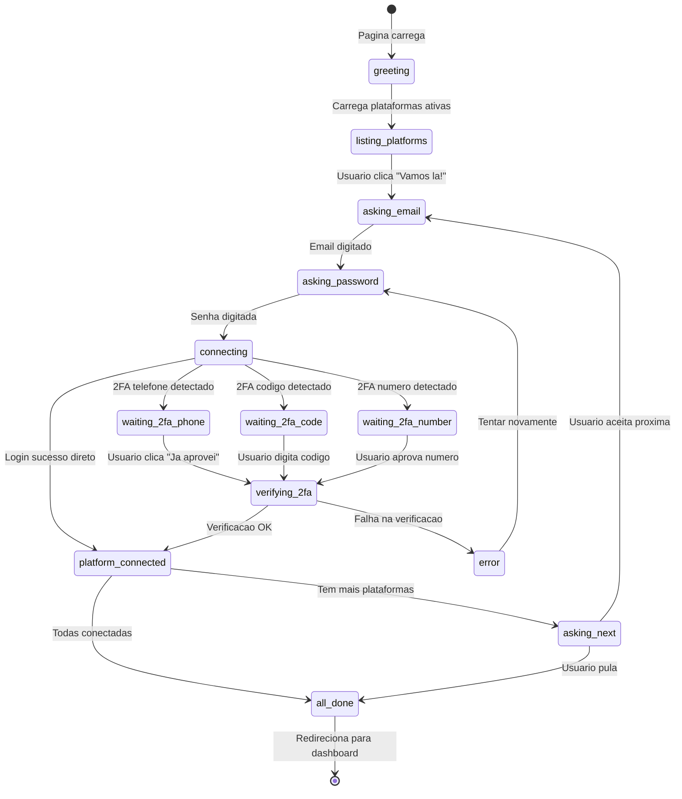
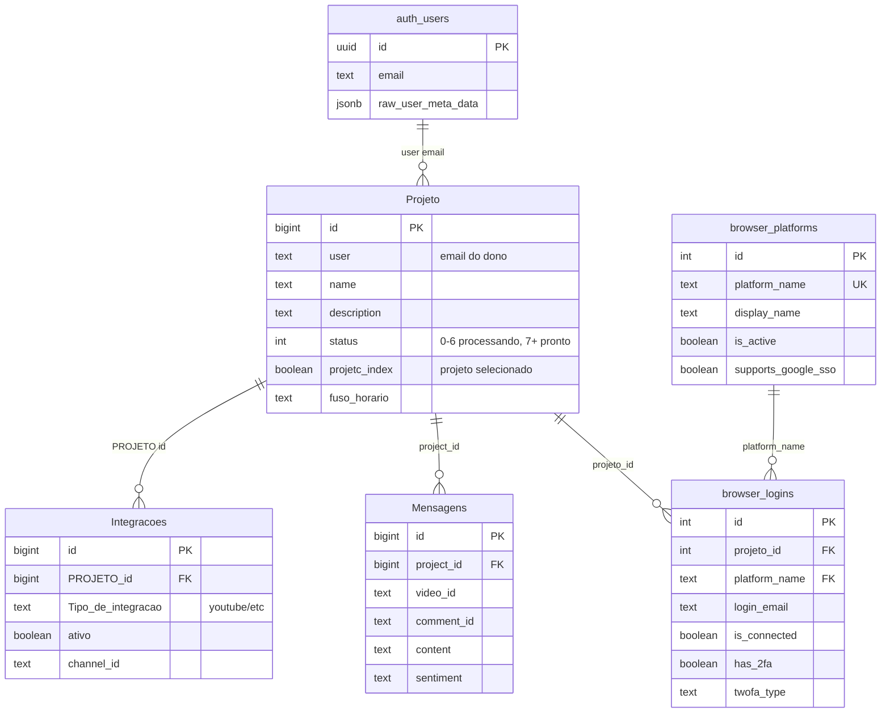

# Jornada Completa do Usuario - Liftlio

> **TL;DR**: Analise completa do fluxo desde o primeiro acesso ate o uso diario do dashboard, identificando pontos de friccao e oportunidades de melhoria.

---

## 1. Fluxo Visual Completo

```mermaid
flowchart TD
    subgraph ENTRADA ["1. ENTRADA"]
        A[Usuario acessa liftlio.com] --> B{Autenticado?}
        B -->|Nao| C[LandingPageHTML]
        B -->|Sim| D[ProtectedLayout]
    end

    subgraph AUTH ["2. AUTENTICACAO"]
        C --> E[Clica Login/Signup]
        E --> F[LoginPage]
        F --> G[OAuth Google]
        G --> H[/auth/callback]
        H --> I{Sucesso?}
        I -->|Sim| D
        I -->|Nao| F
    end

    subgraph GATES ["3. VERIFICACOES (Gates)"]
        D --> J[SubscriptionGate]
        J --> K{Waitlist aprovado?}
        K -->|Nao| L[WaitlistPendingPage]
        K -->|Sim| M{Tem assinatura?}
        M -->|Nao| N[CheckoutPage]
        M -->|Sim| O[check_project_display_state SQL]
    end

    subgraph DISPLAY ["4. DECISAO DE TELA (SQL)"]
        O --> P{display_component?}
        P -->|create_project| Q[ProjectCreationPage]
        P -->|need_integration| R[BrowserIntegrations]
        P -->|setup_processing| S[ProcessingWrapper]
        P -->|integration_disabled| T[Tela de Erro]
        P -->|dashboard| U[Overview/Dashboard]
    end

    subgraph PROJECT ["5. CRIACAO DE PROJETO"]
        Q --> V[Formulario: Nome + Descricao]
        V --> W[Projeto criado status=0]
        W --> R
    end

    subgraph INTEGRATION ["6. INTEGRACAO (Chat UI v2)"]
        R --> X[Agente: Ola! Vamos conectar...]
        X --> Y[Pede email Google]
        Y --> Z[Pede senha]
        Z --> AA[Executa browser_execute_login]
        AA --> AB{2FA detectado?}
        AB -->|Phone| AC[Pede aprovacao telefone]
        AB -->|Code| AD[Pede codigo]
        AB -->|Number| AE[Mostra numero p/ tocar]
        AB -->|Nao| AF[Conectado!]
        AC --> AG[browser_verify_login]
        AD --> AH[browser_submit_2fa_code]
        AE --> AG
        AG --> AF
        AH --> AF
        AF --> AI{Mais plataformas?}
        AI -->|Sim| AJ[Proximo: Reddit/etc]
        AI -->|Nao| AK[Todas conectadas!]
        AJ --> Y
        AK --> S
    end

    subgraph PROCESSING ["7. PROCESSAMENTO INICIAL"]
        S --> AL[Status 0: Iniciando...]
        AL --> AM[Status 1: YouTube API]
        AM --> AN[Status 2: Analisando canal]
        AN --> AO[Status 3: Metricas]
        AO --> AP[Status 4: IA analisa comentarios]
        AP --> AQ[Status 5: Gerando insights]
        AQ --> AR[Status 6: Finalizando]
        AR --> AS{Tem mensagens?}
        AS -->|Sim| U
        AS -->|Nao - aguardando| S
    end

    subgraph DASHBOARD ["8. USO DIARIO"]
        U --> AT[Overview com dados]
        AT --> AU[Monitoring]
        AT --> AV[Mentions]
        AT --> AW[Analytics]
        AT --> AX[Settings]
        AT --> AY[Billing]
    end

    style C fill:#8b5cf6,stroke:#333
    style N fill:#f59e0b,stroke:#333
    style R fill:#10B981,stroke:#333
    style S fill:#3b82f6,stroke:#333
    style U fill:#22c55e,stroke:#333
    style L fill:#ef4444,stroke:#333
    style T fill:#ef4444,stroke:#333
```

---

## 2. Estados por Componente

### 2.1 SubscriptionGate.tsx
| Condicao | Acao |
|----------|------|
| `!waitlist_approved` | Redireciona para `/waitlist-pending` |
| `!has_active_subscription` | Redireciona para `/checkout` |
| Tudo OK | Renderiza children |

### 2.2 check_project_display_state (SQL)
| Condicao | display_component | Tela |
|----------|-------------------|------|
| Sem usuario | `login` | LoginPage |
| Sem projetos | `create_project` | ProjectCreationPage |
| Sem integracao YouTube | `need_integration` | BrowserIntegrations |
| Integracao desativada | `integration_disabled` | Erro |
| Com integracao, sem mensagens, status<=6 | `setup_processing` | ProcessingWrapper |
| Com mensagens | `dashboard` | Overview |

### 2.3 ProjectContext.tsx
| Estado | Significado |
|--------|-------------|
| `isOnboarding` | onboardingStep < 4 |
| `hasProjects` | Usuario tem pelo menos 1 projeto |
| `hasIntegrations` | Projeto atual tem integracoes |
| `isInitialProcessing` | Projeto status 0-6 OU (status=6 sem mensagens) |

---

## 3. Fluxo de Integracao (BrowserIntegrations.tsx)



### Estados do Chat (ChatState)
```typescript
type ChatState =
  | 'greeting'           // Mensagem inicial do agente
  | 'listing_platforms'  // Mostrando plataformas disponiveis
  | 'asking_email'       // Aguardando email
  | 'asking_password'    // Aguardando senha
  | 'connecting'         // Chamando browser_execute_login
  | 'waiting_2fa_phone'  // 2FA: Aprovar no telefone
  | 'waiting_2fa_code'   // 2FA: Digitar codigo
  | 'waiting_2fa_number' // 2FA: Tocar no numero X
  | 'verifying_2fa'      // Verificando 2FA
  | 'platform_connected' // Plataforma conectada com sucesso
  | 'asking_next'        // Perguntando proxima plataforma
  | 'all_done'           // Todas plataformas conectadas
  | 'error';             // Erro no processo
```

---

## 4. Pontos de Friccao Identificados

### 4.1 Friccoes Atuais

| # | Ponto | Problema | Severidade |
|---|-------|----------|------------|
| 1 | **Waitlist** | Usuario aprovado demora a perceber | Media |
| 2 | **Checkout** | Square pode dar erro sem feedback claro | Alta |
| 3 | **Criacao Projeto** | Campos obrigatorios nao claros | Baixa |
| 4 | **Login Google** | 2FA pode confundir usuario | Media |
| 5 | **Processamento** | Status 0-6 pode demorar muito | Alta |
| 6 | **Dashboard Vazio** | Sem mensagens, usuario nao sabe o que fazer | Alta |

### 4.2 Solucoes Propostas

| # | Solucao | Impacto |
|---|---------|---------|
| 1 | Email automatico quando aprovado + notificacao in-app | +30% conversao |
| 2 | Feedback visual de erro Square + retry automatico | -50% abandono |
| 3 | Tooltips e validacao em tempo real | +10% completude |
| 4 | Guia visual de 2FA com imagens | -40% tickets suporte |
| 5 | Estimativa de tempo + notificacao push quando pronto | +25% retencao |
| 6 | Onboarding interativo mostrando proximos passos | +35% engajamento |

---

## 5. Tabelas Envolvidas



---

## 6. Metricas de Funil

```
VISITANTES (Landing)
    |
    v  ~15% conversao
SIGNUP (OAuth Google)
    |
    v  ~80% aprovacao waitlist
WAITLIST APROVADO
    |
    v  ~60% pagam
ASSINANTE (Checkout)
    |
    v  ~95% criam projeto
PROJETO CRIADO
    |
    v  ~70% conectam YouTube
INTEGRACAO CONECTADA
    |
    v  ~90% aguardam processamento
PROCESSAMENTO COMPLETO
    |
    v  ~85% retornam em 7 dias
USUARIO ATIVO
```

**Gargalos principais:**
1. Waitlist -> Assinante (60%) - Melhorar comunicacao de aprovacao
2. Projeto -> Integracao (70%) - Chat UI v2 deve ajudar aqui

---

## 7. Proximos Passos de Melhoria

### Fase 1: Quick Wins (1-2 dias)
- [ ] Adicionar estimativa de tempo no ProcessingWrapper
- [ ] Melhorar mensagens de erro no BrowserIntegrations
- [ ] Adicionar tooltip no botao de 2FA

### Fase 2: UX Improvements (1 semana)
- [ ] Email automatico quando waitlist aprovado
- [ ] Dashboard vazio com CTA claro
- [ ] Tour interativo apos primeira conexao

### Fase 3: Otimizacoes (2 semanas)
- [ ] Reducao do tempo de processamento inicial
- [ ] Cache de sessao browser entre plataformas
- [ ] Notificacao push quando processamento terminar

---

*Documento criado em: 2026-01-01*
*Autor: Claude Code Agent*
*Status: ANALISE COMPLETA*
