# Weekly Report System - Mapa Mental Visual

## Status: ANALISE PROFUNDA COM DIAGRAMAS

> **TL;DR**: Sistema de email semanal com CRON domingo 12:00 UTC.
> Adicionar simulacoes ao report. Template e SQL prontos abaixo.

---

## 1. Fluxo Completo do Sistema


---

## 2. Arquitetura de Tabelas


---

## 3. Dados Atuais (Real-Time)


---

## 4. Fluxo de Variaveis


---

## 5. Timeline do CRON

```mermaid
gantt
    title Weekly Report Timeline
    dateFormat HH:mm
    axisFormat %H:%M

    section Domingo
    CRON Trigger (12:00 UTC)     :a1, 12:00, 1m
    Buscar Analytics             :a2, after a1, 2m
    Buscar Waitlist              :a3, after a1, 1m
    Buscar Simulacoes            :a4, after a1, 1m
    Montar Template              :a5, after a2, 1m
    Enviar Email 1               :a6, after a5, 3m
    Enviar Email 2               :a7, after a6, 3m
    Concluido                    :milestone, after a7, 0m
```



---

## 6. Comparativo: Antes vs Depois


---

## 7. Template HTML Visual

```
+------------------------------------------------------------------+
|                         LIFTLIO                                   |
|                      Weekly Report                                |
|                   (header roxo gradient)                          |
+------------------------------------------------------------------+
|                                                                   |
|                         Period                                    |
|                   23 Dec - 30 Dec 2025                           |
|                                                                   |
+------------------------------------------------------------------+
|                                                                   |
|   +----------------+  +----------------+  +----------------+      |
|   |      15       |  |      125      |  |      238      |      |
|   |   VISITORS    |  |   SESSIONS    |  |   PAGEVIEWS   |      |
|   |  (roxo grad)  |  |   (cinza)     |  |   (cinza)     |      |
|   +----------------+  +----------------+  +----------------+      |
|                                                                   |
+------------------------------------------------------------------+
|                                                                   |
|   +----------------------------------------------------------+   |
|   |              New Waitlist Signups This Week              |   |
|   |                        +1                                 |   |
|   |              Total in queue: 5 people                    |   |
|   |                   (verde gradient)                        |   |
|   +----------------------------------------------------------+   |
|                                                                   |
+------------------------------------------------------------------+
|                                                                   |
|   +----------------------------------------------------------+   |  <-- NOVO!
|   |              Landing Page Simulations                     |   |
|   |       +----------------+  +----------------+              |   |
|   |       |       2       |  |      44       |              |   |
|   |       |   THIS WEEK   |  |     TOTAL     |              |   |
|   |       +----------------+  +----------------+              |   |
|   |                   (azul gradient)                         |   |
|   +----------------------------------------------------------+   |
|                                                                   |
+------------------------------------------------------------------+
|                                                                   |
|               [ View Full Dashboard ]                            |
|                   (botao roxo)                                   |
|                                                                   |
+------------------------------------------------------------------+
|                                                                   |
|           Automatic report sent every Sunday                     |
|           2025 Liftlio. All rights reserved.                     |
|                                                                   |
+------------------------------------------------------------------+
```

---

## 8. HTML do Bloco de Simulacoes (NOVO)

```html
<!-- Landing Page Simulations Section - ADICIONAR AO TEMPLATE -->
<tr>
    <td style="padding: 10px 40px;">
        <table cellpadding="0" cellspacing="0" border="0" width="100%"
               style="background: linear-gradient(135deg, #3b82f6 0%, #1d4ed8 100%); border-radius: 12px;">
            <tr>
                <td style="padding: 20px; text-align: center;">
                    <p style="margin: 0; font-size: 14px; color: rgba(255,255,255,0.9);">
                        Landing Page Simulations
                    </p>
                    <table cellpadding="0" cellspacing="0" border="0" width="100%" style="margin-top: 15px;">
                        <tr>
                            <td width="50%" style="text-align: center;">
                                <p style="margin: 0; font-size: 36px; font-weight: 800; color: #ffffff;">
                                    {{simulations_week}}
                                </p>
                                <p style="margin: 5px 0 0; font-size: 11px; color: rgba(255,255,255,0.8); text-transform: uppercase;">
                                    This Week
                                </p>
                            </td>
                            <td width="50%" style="text-align: center;">
                                <p style="margin: 0; font-size: 36px; font-weight: 800; color: #ffffff;">
                                    {{simulations_total}}
                                </p>
                                <p style="margin: 5px 0 0; font-size: 11px; color: rgba(255,255,255,0.8); text-transform: uppercase;">
                                    All Time
                                </p>
                            </td>
                        </tr>
                    </table>
                </td>
            </tr>
        </table>
    </td>
</tr>
```

---

## 9. SQL Function Completa (Pronta para Deploy)

```sql
-- =============================================
-- Funcao: send_weekly_owner_report (v2.0)
-- Descricao: Envia relatorio semanal com simulacoes
-- Atualizado: 2025-12-30
-- Autor: Claude Code
-- =============================================
-- CRON: Todo domingo as 12:00 UTC (09:00 BRT)
-- SELECT cron.schedule('weekly_owner_report', '0 12 * * 0', 'SELECT send_weekly_owner_report()');
-- =============================================

DROP FUNCTION IF EXISTS public.send_weekly_owner_report();

CREATE OR REPLACE FUNCTION public.send_weekly_owner_report()
RETURNS jsonb
LANGUAGE plpgsql
SECURITY DEFINER
AS $function$
DECLARE
    v_owner_emails TEXT[] := ARRAY['valdair3d@gmail.com', 'steven@stevenjwilson.com'];
    v_project_id INTEGER := 117;  -- Projeto Liftlio (tracking proprio site)

    -- Analytics data
    v_unique_visitors INTEGER;
    v_total_sessions INTEGER;
    v_total_pageviews INTEGER;
    v_week_range TEXT;

    -- Waitlist data
    v_total_waitlist INTEGER;
    v_new_waitlist_count INTEGER;
    v_has_new_waitlist BOOLEAN;

    -- Simulations data (NOVO!)
    v_simulations_week INTEGER;
    v_simulations_total INTEGER;

    -- Template selection
    v_template_id UUID;
    v_subject TEXT;
    v_variables JSONB;

    -- Result
    v_result JSONB;
    v_email TEXT;
    v_send_result JSONB;
    v_results JSONB := '[]'::jsonb;
BEGIN
    -- =============================================
    -- 1. BUSCAR DADOS DO ANALYTICS (ultimos 7 dias)
    -- =============================================
    SELECT
        COUNT(DISTINCT visitor_id),
        COUNT(DISTINCT session_id),
        COUNT(CASE WHEN event_type = 'pageview' THEN 1 END)
    INTO v_unique_visitors, v_total_sessions, v_total_pageviews
    FROM analytics
    WHERE project_id = v_project_id
    AND created_at >= NOW() - INTERVAL '7 days';

    -- Gerar range da semana
    v_week_range := TO_CHAR(NOW() - INTERVAL '7 days', 'DD Mon') || ' - ' || TO_CHAR(NOW(), 'DD Mon YYYY');

    -- =============================================
    -- 2. BUSCAR DADOS DA WAITLIST
    -- =============================================
    SELECT
        COUNT(*),
        COUNT(CASE WHEN created_at >= NOW() - INTERVAL '7 days' THEN 1 END)
    INTO v_total_waitlist, v_new_waitlist_count
    FROM waitlist;

    v_has_new_waitlist := v_new_waitlist_count > 0;

    -- =============================================
    -- 3. BUSCAR SIMULACOES DA LANDING PAGE (NOVO!)
    -- =============================================
    SELECT
        COUNT(CASE WHEN created_at > NOW() - INTERVAL '7 days' THEN 1 END),
        COUNT(*)
    INTO v_simulations_week, v_simulations_total
    FROM url_analyzer_rate_limit;

    -- =============================================
    -- 4. ESCOLHER TEMPLATE CORRETO
    -- =============================================
    IF v_has_new_waitlist THEN
        SELECT id INTO v_template_id
        FROM email_templates
        WHERE name = 'weekly_report_with_waitlist'
        AND is_active = true;

        v_subject := 'Liftlio Weekly Report - ' || v_week_range || ' - ' || v_new_waitlist_count || ' New Signups!';
    ELSE
        SELECT id INTO v_template_id
        FROM email_templates
        WHERE name = 'weekly_report_no_waitlist'
        AND is_active = true;

        v_subject := 'Liftlio Weekly Report - ' || v_week_range;
    END IF;

    -- Verificar se template existe
    IF v_template_id IS NULL THEN
        RETURN jsonb_build_object(
            'success', false,
            'error', 'Template not found: ' || CASE WHEN v_has_new_waitlist THEN 'weekly_report_with_waitlist' ELSE 'weekly_report_no_waitlist' END
        );
    END IF;

    -- =============================================
    -- 5. MONTAR VARIAVEIS DO TEMPLATE (COM SIMULACOES)
    -- =============================================
    v_variables := jsonb_build_object(
        'week_range', v_week_range,
        'unique_visitors', v_unique_visitors::TEXT,
        'total_sessions', v_total_sessions::TEXT,
        'total_pageviews', v_total_pageviews::TEXT,
        'total_waitlist', v_total_waitlist::TEXT,
        'new_waitlist_count', v_new_waitlist_count::TEXT,
        'simulations_week', v_simulations_week::TEXT,      -- NOVO!
        'simulations_total', v_simulations_total::TEXT     -- NOVO!
    );

    -- =============================================
    -- 6. ENVIAR EMAIL PARA CADA DESTINATARIO
    -- =============================================
    FOREACH v_email IN ARRAY v_owner_emails
    LOOP
        v_send_result := send_email(
            v_email,
            v_subject,
            NULL,
            NULL,
            v_template_id::TEXT,
            v_variables,
            NULL,
            NULL,
            'simple'
        );

        v_results := v_results || jsonb_build_object(
            'email', v_email,
            'result', v_send_result
        );
    END LOOP;

    -- 7. RETORNAR RESULTADO
    RETURN jsonb_build_object(
        'success', true,
        'recipients', v_owner_emails,
        'send_results', v_results,
        'report_data', jsonb_build_object(
            'week_range', v_week_range,
            'unique_visitors', v_unique_visitors,
            'total_sessions', v_total_sessions,
            'total_pageviews', v_total_pageviews,
            'total_waitlist', v_total_waitlist,
            'new_waitlist_count', v_new_waitlist_count,
            'simulations_week', v_simulations_week,        -- NOVO!
            'simulations_total', v_simulations_total,      -- NOVO!
            'template_used', CASE WHEN v_has_new_waitlist THEN 'with_waitlist' ELSE 'no_waitlist' END
        )
    );

EXCEPTION WHEN OTHERS THEN
    RETURN jsonb_build_object(
        'success', false,
        'error', 'Exception in send_weekly_owner_report: ' || SQLERRM
    );
END;
$function$;

-- =============================================
-- TESTE MANUAL (nao envia, apenas mostra dados)
-- =============================================
-- SELECT send_weekly_owner_report();
```

---

## 10. Checklist de Implementacao

- [ ] Atualizar funcao `send_weekly_owner_report()` com simulacoes
- [ ] Adicionar bloco HTML de simulacoes ao template `weekly_report_with_waitlist`
- [ ] Adicionar bloco HTML de simulacoes ao template `weekly_report_no_waitlist`
- [ ] Testar manualmente: `SELECT send_weekly_owner_report()`
- [ ] Verificar email recebido com nova secao
- [ ] Salvar backup da funcao em `09_Email/send_weekly_owner_report.sql`

---

## 11. Resultado Esperado

```json
{
  "success": true,
  "recipients": ["valdair3d@gmail.com", "steven@stevenjwilson.com"],
  "report_data": {
    "week_range": "23 Dec - 30 Dec 2025",
    "unique_visitors": 15,
    "total_sessions": 125,
    "total_pageviews": 238,
    "total_waitlist": 5,
    "new_waitlist_count": 1,
    "simulations_week": 2,
    "simulations_total": 44,
    "template_used": "with_waitlist"
  }
}
```

---

*Mapa Mental criado em 2025-12-30*
*Status: SQL e Template PRONTOS para deploy*
